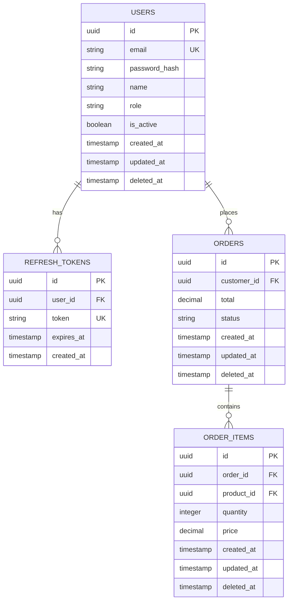

# Entity Relationship Diagram (ERD)

## order-service

This document describes the database schema for order-api.

## Diagram



## Tables

### Base Fields

All entities include the following base fields:

| Column | Type | Constraints | Description |
|--------|------|-------------|-------------|
| id | UUID | PRIMARY KEY | Unique identifier |
| created_at | TIMESTAMP | NOT NULL | Creation timestamp |
| updated_at | TIMESTAMP | NOT NULL | Last update timestamp |
| deleted_at | TIMESTAMP | NULLABLE | Soft delete timestamp |

### Users

User accounts for authentication.

| Column | Type | Constraints | Description |
|--------|------|-------------|-------------|
| id | UUID | PRIMARY KEY | Unique identifier |
| email | VARCHAR(255) | UNIQUE, NOT NULL | User email |
| password_hash | VARCHAR(255) | NOT NULL | Bcrypt password hash |
| name | VARCHAR(255) | NOT NULL | User display name |
| role | VARCHAR(50) | NOT NULL | User role (admin, user) |
| is_active | BOOLEAN | DEFAULT true | Account active status |
| created_at | TIMESTAMP | NOT NULL | Creation timestamp |
| updated_at | TIMESTAMP | NOT NULL | Last update timestamp |
| deleted_at | TIMESTAMP | NULLABLE | Soft delete timestamp |

### Refresh Tokens

JWT refresh tokens for session management.

| Column | Type | Constraints | Description |
|--------|------|-------------|-------------|
| id | UUID | PRIMARY KEY | Unique identifier |
| user_id | UUID | FOREIGN KEY | Reference to users |
| token | VARCHAR(500) | UNIQUE, NOT NULL | Refresh token value |
| expires_at | TIMESTAMP | NOT NULL | Token expiration |
| created_at | TIMESTAMP | NOT NULL | Creation timestamp |

### Orders

Customer orders with status tracking.

| Column | Type | Constraints | Description |
|--------|------|-------------|-------------|
| id | UUID | PRIMARY KEY | Unique identifier |
| customer_id | UUID | FOREIGN KEY, NOT NULL | Reference to users |
| total | DECIMAL(10,2) | NOT NULL | Order total amount |
| status | VARCHAR(50) | NOT NULL | Order status (pending, confirmed, shipped, delivered, cancelled) |
| created_at | TIMESTAMP | NOT NULL | Creation timestamp |
| updated_at | TIMESTAMP | NOT NULL | Last update timestamp |
| deleted_at | TIMESTAMP | NULLABLE | Soft delete timestamp |

### Order Items

Individual line items within an order.

| Column | Type | Constraints | Description |
|--------|------|-------------|-------------|
| id | UUID | PRIMARY KEY | Unique identifier |
| order_id | UUID | FOREIGN KEY, NOT NULL | Reference to orders |
| product_id | UUID | FOREIGN KEY, NOT NULL | Reference to products |
| quantity | INTEGER | NOT NULL | Item quantity |
| price | DECIMAL(10,2) | NOT NULL | Item price at time of order |
| created_at | TIMESTAMP | NOT NULL | Creation timestamp |
| updated_at | TIMESTAMP | NOT NULL | Last update timestamp |
| deleted_at | TIMESTAMP | NULLABLE | Soft delete timestamp |

## Indexes

```sql
-- Add indexes for frequently queried columns
CREATE INDEX idx_users_email ON users(email);
CREATE INDEX idx_users_role ON users(role);
CREATE INDEX idx_refresh_tokens_user_id ON refresh_tokens(user_id);
CREATE INDEX idx_refresh_tokens_expires_at ON refresh_tokens(expires_at);

-- Order indexes
CREATE INDEX idx_orders_customer_id ON orders(customer_id);
CREATE INDEX idx_orders_status ON orders(status);
CREATE INDEX idx_orders_created_at ON orders(created_at);

-- Order Items indexes
CREATE INDEX idx_order_items_order_id ON order_items(order_id);
CREATE INDEX idx_order_items_product_id ON order_items(product_id);
```

## Notes

1. All UUIDs are generated using UUID v4
2. Soft delete is implemented via `deleted_at` column
3. Timestamps are stored in UTC
4. Indexes should be added based on query patterns
