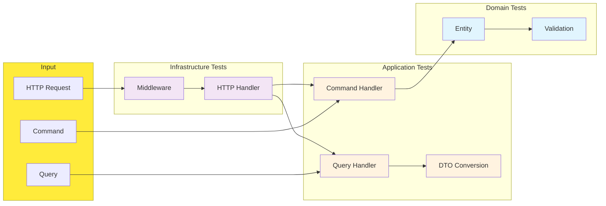
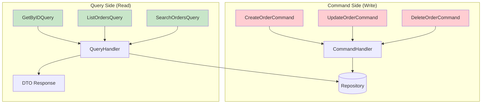
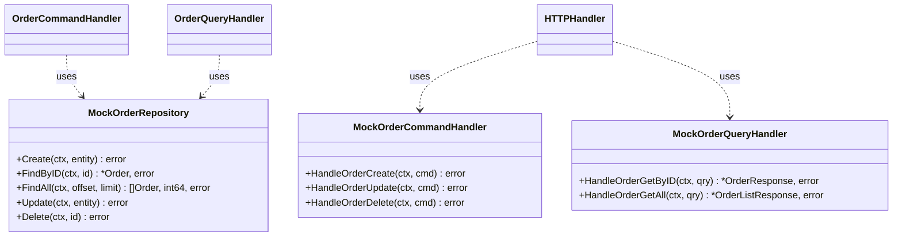
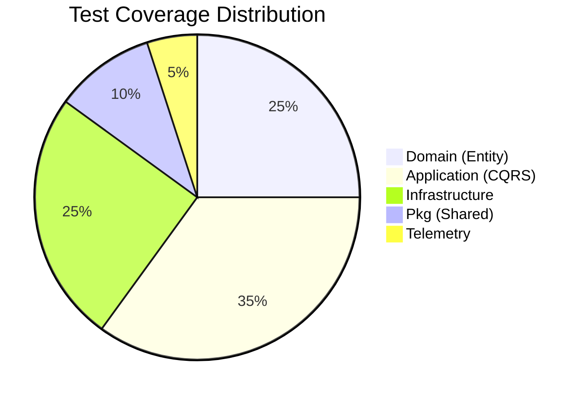
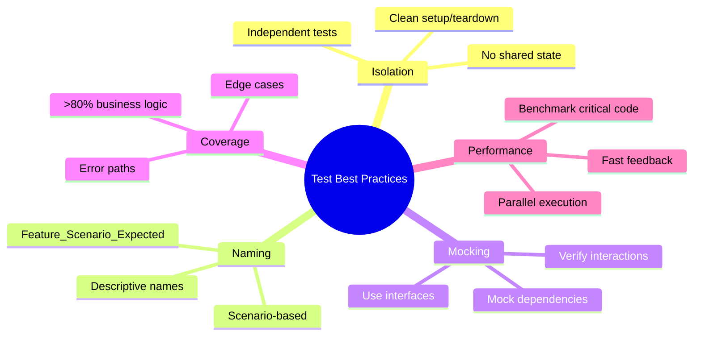

# Unit Tests

Comprehensive unit tests for the Order Service following Domain-Driven Design (DDD) and CQRS patterns.

## Architecture Overview

```mermaid
graph TB
    subgraph "Test Organization by DDD Layers"
        direction TB

        subgraph Domain["domain/"]
            subgraph DomEntity["entity/"]
                E[entity_test.go]
            end
        end

        subgraph Application["application/"]
            subgraph AppCmd["command/"]
                C[command_test.go]
            end
            subgraph AppQry["query/"]
                Q[queries_test.go]
                Q2[query_test.go]
            end
            subgraph AppHdl["handler/"]
                H[handler_test.go]
            end
            subgraph AppDTO["dto/"]
                D[dto_test.go]
            end
        end

        subgraph Infrastructure["infrastructure/"]
            subgraph InfCfg["config/"]
                CF[config_test.go]
            end
            subgraph InfMW["middleware/"]
                M[middleware_test.go]
            end
            subgraph InfHTTP["http/"]
                HH[http_handler_test.go]
            end
        end

        subgraph Pkg["pkg/"]
            subgraph PkgVal["validator/"]
                V[validator_test.go]
            end
            subgraph PkgRes["response/"]
                R[response_test.go]
            end
        end

        subgraph Telemetry["telemetry/"]
            subgraph TelSDK["sdk/"]
                T[telemetry_test.go]
            end
        end
    end

    E --> |"Tests"| DE[Base, Order, Orderitem]
    C --> |"Tests"| DC[Create, Update, Delete Commands]
    Q --> |"Tests"| DQ[GetByID, GetAll, Search Queries]
    H --> |"Tests"| DH[Command & Query Handlers]
    D --> |"Tests"| DD[Entity ↔ DTO Conversion]
    M --> |"Tests"| DM[Auth, RateLimit, RBAC]
    CF --> |"Tests"| DCF[Env Vars, Defaults]
    HH --> |"Tests"| DHH[HTTP Endpoints]
    V --> |"Tests"| DV[Struct Tag Validation]
    R --> |"Tests"| DR[API Response Format]
    T --> |"Tests"| DT[SDK Init, Shutdown]

    style Domain fill:#e1f5fe
    style Application fill:#fff3e0
    style Infrastructure fill:#f3e5f5
    style Pkg fill:#e8f5e9
    style Telemetry fill:#fce4ec
```



## Test Flow



## Test Organization

Tests are organized by DDD architectural layers with granular subdirectories:

```
tests/unit/
├── domain/                       # Domain Layer Tests
│   └── entity/                   # Entity subdomain
│       └── entity_test.go        # Domain entities (Base, Order, Orderitem)
│
├── application/                  # Application Layer Tests
│   ├── command/                  # Command subdomain
│   │   └── command_test.go       # CQRS commands (Create, Update, Delete)
│   ├── query/                    # Query subdomain
│   │   ├── queries_test.go       # CQRS queries (GetByID, GetAll, List, Search)
│   │   └── query_test.go         # Additional query tests
│   ├── handler/                  # Handler subdomain
│   │   └── handler_test.go       # Command & Query handlers
│   └── dto/                      # DTO subdomain
│       └── dto_test.go           # Data Transfer Object conversions
│
├── infrastructure/               # Infrastructure Layer Tests
│   ├── config/                   # Configuration subdomain
│   │   └── config_test.go        # Configuration loading
│   ├── middleware/               # Middleware subdomain
│   │   └── middleware_test.go    # HTTP middleware (Auth, RateLimit)
│   └── http/                     # HTTP subdomain
│       └── http_handler_test.go  # HTTP endpoint handlers
│
├── pkg/                          # Shared Package Tests
│   ├── validator/                # Validator subdomain
│   │   └── validator_test.go     # Request validation
│   └── response/                 # Response subdomain
│       └── response_test.go      # HTTP response helpers
│
└── telemetry/                    # Observability Tests
    └── sdk/                      # SDK subdomain
        └── telemetry_test.go     # TelemetryFlow SDK integration
```

All tests use external test packages (`package <name>_test`) to ensure proper encapsulation and test the public API surface.

## CQRS Pattern Testing



## Running Tests

### Run All Unit Tests

```bash
go test ./tests/unit/... -v
```

### Run Tests by Layer

```bash
# Domain layer
go test ./tests/unit/domain/... -v

# Application layer
go test ./tests/unit/application/... -v

# Infrastructure layer
go test ./tests/unit/infrastructure/... -v

# Package tests
go test ./tests/unit/pkg/... -v

# Telemetry tests
go test ./tests/unit/telemetry/... -v
```

### Run Tests by Subdomain

```bash
# Domain entity tests
go test ./tests/unit/domain/entity/... -v

# Application command tests
go test ./tests/unit/application/command/... -v

# Application query tests
go test ./tests/unit/application/query/... -v

# Application handler tests
go test ./tests/unit/application/handler/... -v

# Application DTO tests
go test ./tests/unit/application/dto/... -v

# Infrastructure config tests
go test ./tests/unit/infrastructure/config/... -v

# Infrastructure middleware tests
go test ./tests/unit/infrastructure/middleware/... -v

# Infrastructure HTTP tests
go test ./tests/unit/infrastructure/http/... -v
```

### Run with Coverage

```bash
# Generate coverage report
go test ./tests/unit/... -cover -coverprofile=coverage.out

# View coverage in browser
go tool cover -html=coverage.out

# View coverage summary
go tool cover -func=coverage.out
```

### Run Benchmarks

```bash
# Run all benchmarks
go test ./tests/unit/... -bench=. -benchmem

# Run specific benchmark
go test ./tests/unit/domain/... -bench=BenchmarkNewOrder -benchmem
```

### Run Specific Test

```bash
# Run a specific test function
go test ./tests/unit/domain/... -run TestNewOrder -v

# Run tests matching a pattern
go test ./tests/unit/... -run ".*Validate.*" -v
```

## Mock Architecture



## Test Patterns

All tests follow these conventions:

### Table-Driven Tests

```go
func TestExample(t *testing.T) {
    tests := []struct {
        name     string
        input    string
        expected string
    }{
        {"valid input", "test", "TEST"},
        {"empty input", "", ""},
    }

    for _, tt := range tests {
        t.Run(tt.name, func(t *testing.T) {
            result := Transform(tt.input)
            assert.Equal(t, tt.expected, result)
        })
    }
}
```

### Arrange-Act-Assert Structure

```go
func TestOrderCreate(t *testing.T) {
    // Arrange
    customerID := uuid.New()
    total := 100.0

    // Act
    order := entity.NewOrder(customerID, total, "pending")

    // Assert
    assert.NotNil(t, order)
    assert.Equal(t, customerID, order.CustomerID)
}
```

### Mock-Based Testing

```go
func TestHandler(t *testing.T) {
    // Setup mock
    mockRepo := new(MockOrderRepository)
    mockRepo.On("Create", mock.Anything, mock.AnythingOfType("*entity.Order")).Return(nil)

    // Execute
    handler := NewHandler(mockRepo)
    err := handler.Create(ctx, cmd)

    // Verify
    assert.NoError(t, err)
    mockRepo.AssertExpectations(t)
}
```

## Test Coverage by Component



| Layer          | Package                    | Coverage Focus                           |
|----------------|----------------------------|------------------------------------------|
| Domain         | `entity`                   | Entity creation, validation, soft delete |
| Application    | `command`                  | Command validation, entity conversion    |
| Application    | `query`                    | Query validation, pagination defaults    |
| Application    | `handler`                  | CQRS handler orchestration               |
| Application    | `dto`                      | Entity-to-DTO conversion                 |
| Infrastructure | `middleware`               | JWT auth, rate limiting, RBAC            |
| Infrastructure | `config`                   | Env var loading, defaults                |
| Infrastructure | `http/handler`             | HTTP request/response handling           |
| Pkg            | `validator`                | Struct tag validation                    |
| Pkg            | `response`                 | Standardized API responses               |
| Telemetry      | `telemetry`                | SDK initialization, graceful degradation |

## Dependencies

Tests use the following packages:

- `github.com/stretchr/testify/assert` - Assertions
- `github.com/stretchr/testify/require` - Fatal assertions
- `github.com/stretchr/testify/mock` - Mocking framework
- `github.com/labstack/echo/v4` - HTTP testing
- `net/http/httptest` - HTTP test utilities

## Best Practices



1. **Isolation**: Each test should be independent and not rely on external state
2. **Naming**: Use descriptive test names that explain the scenario
3. **Mocking**: Mock external dependencies to focus on unit under test
4. **Coverage**: Aim for >80% coverage on business logic
5. **Benchmarks**: Include benchmarks for performance-critical code
6. **Edge Cases**: Test boundary conditions and error scenarios

---

Generated by TelemetryFlow RESTful API Generator
Copyright (c) 2024-2026 DevOpsCorner Indonesia. All rights reserved.
